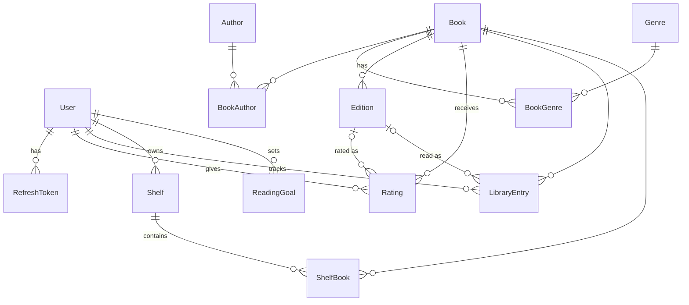

# Bookshelf API

REST API for readers in the spirit of Goodreads / lubimyczytac.pl. Users browse a catalog of books, authors, editions and genres imported from Open Library data dumps, rate and review books, keep a reading library with statuses and progress, organize shelves and set yearly reading goals. Administrators manage the catalog and users.

## Features

- Catalog of books (Open Library works), authors, editions and genres with search, filters, sorting and pagination
- Ratings 1–10 with optional reviews, per-book statistics and rating distribution
- Reading library: want to read / reading / read with dates and page progress
- Public and private shelves
- Yearly reading goals with progress tracking
- JWT authentication with refresh token rotation and reuse detection, `USER` and `ADMIN` roles
- OpenAPI documentation (Swagger UI)

## Stack

- Node.js 24 LTS (24.15+ if you want to use the Nest CLI generators), pnpm 10
- NestJS 12 (CommonJS), TypeScript 6
- Prisma ORM 7 with the `prisma-client` generator and `@prisma/adapter-pg`
- PostgreSQL 16+
- `@nestjs/swagger` 12, Passport JWT, bcrypt, class-validator / class-transformer, zod (env validation), helmet, `@nestjs/throttler`

## Quick start

```bash
pnpm install                 # also runs prisma generate
createdb bookshelf           # or create the database with any client
cp .env.example .env         # set DATABASE_URL and two JWT secrets (32+ characters)
pnpm prisma migrate dev      # apply migrations
pnpm prisma db seed          # load data/openlibrary/*.json, create admin and demo accounts
pnpm start:dev
```

- Swagger UI: http://localhost:3000/docs (JSON document: http://localhost:3000/docs-json)
- API base URL: http://localhost:3000/api/v1
- `pnpm prisma migrate reset` drops the database, re-applies migrations and runs the seed again.

Accounts created by the seed:

| Account | Credentials                                                                                             | Notes                                                              |
| ------- | ------------------------------------------------------------------------------------------------------- | ------------------------------------------------------------------ |
| admin   | `SEED_ADMIN_EMAIL` / `SEED_ADMIN_PASSWORD` from `.env` (defaults `admin@bookshelf.local` / `Admin123!`) | role `ADMIN`                                                       |
| demo    | `demo@bookshelf.local` / `Demo1234!`                                                                    | sample ratings, library entries, a public shelf and a reading goal |

Scripts: `build`, `start:dev`, `start:prod`, `lint` (oxlint), `format` (prettier), `prisma:generate`, `prisma:migrate`, `prisma:seed`, `ol:select`, `ol:extract`.

## Data pipeline (Open Library dumps)

The catalog is a small subset of Open Library: the N most rated works, their authors, up to 5 editions per work and the most frequent subjects as genres. The application never calls the Open Library API; the only runtime reference is cover URLs on `covers.openlibrary.org`. The ETL scripts read local dump files and write small JSON files that are committed to the repository, so a fresh clone does not need the dumps at all.

1. Download the dumps from https://openlibrary.org/developers/dumps and keep them outside the repository (for example in `~/ol-dumps`): `ol_dump_ratings_latest.txt.gz`, `ol_dump_works_latest.txt.gz`, `ol_dump_authors_latest.txt.gz`, `ol_dump_editions_latest.txt.gz`.
2. Pick the most rated works (`--top` controls the catalog size):

   ```bash
   pnpm ol:select --ratings ~/ol-dumps/ol_dump_ratings_latest.txt.gz --top 500 --out tmp
   ```

   Writes `tmp/work-keys.txt` and `tmp/ratings-agg.json`.

3. Extract works, editions, authors and genres. The scripts accept `.txt.gz` or plain `.txt` files, so the simplest form is:

   ```bash
   pnpm ol:extract --works ~/ol-dumps/ol_dump_works_latest.txt.gz \
     --editions ~/ol-dumps/ol_dump_editions_latest.txt.gz \
     --authors ~/ol-dumps/ol_dump_authors_latest.txt.gz \
     --keys tmp/work-keys.txt --ratings tmp/ratings-agg.json --out data/openlibrary
   ```

   Streaming the full editions dump through Node takes a while. Pre-filtering with `grep` is much faster:

   ```bash
   zcat ~/ol-dumps/ol_dump_works_latest.txt.gz    | grep -F -f tmp/work-keys.txt > tmp/works.txt
   zcat ~/ol-dumps/ol_dump_editions_latest.txt.gz | grep -F -f tmp/work-keys.txt > tmp/editions.txt
   pnpm ol:extract --stage works --works tmp/works.txt --editions tmp/editions.txt
   zcat ~/ol-dumps/ol_dump_authors_latest.txt.gz  | grep -F -f tmp/author-keys.txt > tmp/authors.txt
   pnpm ol:extract --stage all --authors tmp/authors.txt
   ```

   Options: `--editions-per-work 5`, `--genres 40`, `--min-genre-books 3`.

4. The result lands in `data/openlibrary/` (`works.json`, `authors.json`, `editions.json`, `genres.json`). `pnpm prisma db seed` loads these files; it uses `createMany` with `skipDuplicates`, so running it again does not duplicate records.

How the dump data is mapped:

- work → `Book`, edition → `Edition`, author → `Author`; Open Library keys are stored without prefixes (`OL27448W`, `OL26320A`, `OL7440033M`) and are unique but optional, so records created by an admin simply have none.
- Open Library community ratings (1–5) are stored as `olAverageRating` (×2, on the 1–10 scale) and `olRatingsCount`; they are informational and never mixed with ratings given by users of this API.
- Editions are scored (ISBN-13, cover, English/Polish language, page count, the work's `cover_edition`) and the best ones are kept. ISBNs are normalized and deduplicated because the columns are unique.
- When a work has no authors, first publish year or cover, the values are taken from its editions.
- Genres come from work subjects: normalized, counted across the selected works, filtered against a denylist of technical tags (`accessible book`, `protected daisy`, `nyt:*`, ...) and limited to the most frequent ones; each book gets up to 5 genres.

## Architecture

```
src/
├── main.ts, app.module.ts
├── config/env.ts            zod schema, the app refuses to start on invalid env
├── database/                DatabaseService extends PrismaClient (pg driver adapter)
├── common/                  pagination, error filter, pipes (ISBN, year), utils (covers, slug, dates)
├── auth/                    Passport JWT strategy, guards, decorators, token issuing
├── users/  books/  authors/  editions/  genres/
├── ratings/  library/  shelves/  reading-goals/
└── generated/prisma/        generated client (gitignored)
prisma/                      schema, migrations, seed
scripts/openlibrary/         ETL
data/openlibrary/            ETL output loaded by the seed
```

Each resource is a Nest module in `src/<resource>/`: the controller handles routing, validation and Swagger metadata, the service holds the logic and Prisma queries, the mapper turns Prisma rows into response DTOs (Prisma models are never returned directly). Admin routes live in separate `*-admin.controller.ts` files guarded by `@Roles([Role.ADMIN])`.

### REST conventions

- Everything is served under `/api/v1` (global prefix + URI versioning). Resources are plural and kebab-case, the current user's resources live under `/me/...`, public data of other users under `/users/:username/...`.
- Entities are addressed by UUID, genres by slug, editions additionally by ISBN-10/13.
- List endpoints accept `page` (≥ 1) and `limit` (1–100) plus resource-specific filters and `sort`/`order`, and return `{ "data": [...], "meta": { "page", "limit", "total", "totalPages" } }`.
- Status codes: `200`/`201`/`204`, `400` for validation and business rule errors, `401` missing or invalid token, `403` insufficient role, `404` missing resources (also private shelves of other users), `409` uniqueness conflicts.
- Every error has the same shape:

  ```json
  {
    "statusCode": 404,
    "code": "NOT_FOUND",
    "message": "Book not found",
    "details": null,
    "path": "/api/v1/books/...",
    "timestamp": "2026-09-25T10:00:00.000Z"
  }
  ```

  Codes: `VALIDATION_ERROR` (with `details: [{ "field", "messages" }]`), `BAD_REQUEST`, `UNAUTHORIZED`, `FORBIDDEN`, `NOT_FOUND`, `CONFLICT`, `TOO_MANY_REQUESTS`, `INTERNAL_ERROR`. Prisma errors are translated as well: `P2002` → 409, `P2025` → 404, `P2003` → 400.

### Authentication

- `POST /auth/register` and `POST /auth/login` return an access token (JWT HS256, 15 minutes, payload `sub`, `username`, `role`) and a refresh token (30 days). Only the SHA-256 hash of the refresh token is stored.
- `POST /auth/refresh` rotates the pair: the presented token is revoked and a new pair is issued. Presenting an already rotated token is treated as reuse and revokes every session of that user.
- `POST /auth/logout` revokes the given refresh token, `PATCH /auth/password` revokes all of them.
- Protected routes require `Authorization: Bearer <access token>`. Public routes marked in Swagger as accepting an optional token (`GET /books/:id`, `GET /shelves/:id`, ...) personalize the response when a valid token is sent and ignore invalid ones.
- Register and login are rate limited to 10 requests per minute per IP.

### Design decisions

- A rating is a 1–10 value with an optional review, one per user and book. `ratingsCount`, `ratingSum` and `averageRating` on the book are updated in the same transaction as the rating.
- `LibraryEntry` is the exclusive reading status of a book (one per user and book); shelves are independent collections, so a book can be on many shelves.
- `editionId` on ratings and library entries is optional and must belong to the same book (`400` otherwise).
- `startedAt` / `finishedAt` are dates without time (`YYYY-MM-DD`). Setting `READING` without `startedAt` uses today's date, `READ` without `finishedAt` uses today, `WANT_TO_READ` clears `finishedAt` and `currentPage`. `finishedAt` earlier than `startedAt` and `currentPage` above the edition page count are rejected.
- Deleting a user cascades to tokens, ratings, library entries, shelves and goals; deleting a book removes its editions, relations, ratings, library entries and shelf items; deleting an edition sets `editionId` to `null` where it was referenced.
- Only cover and photo ids are stored; URLs (`https://covers.openlibrary.org/b/id/{id}-M.jpg`, `.../a/id/{id}-M.jpg`) are built in the mappers.
- Value ranges enforced by the DTOs are mirrored by `CHECK` constraints in the initial migration (rating 1–10, goal target 1–1000, year 2000–2100, `currentPage` ≥ 0).

## Data model



## Endpoints

All paths are relative to `/api/v1`. Access: public, user (valid access token), admin (`ADMIN` role), optional (public, token personalizes the response).

| Module        | Method | Path                                   | Access   |
| ------------- | ------ | -------------------------------------- | -------- |
| Health        | GET    | `/health`                              | public   |
| Auth          | POST   | `/auth/register`                       | public   |
| Auth          | POST   | `/auth/login`                          | public   |
| Auth          | POST   | `/auth/refresh`                        | public   |
| Auth          | POST   | `/auth/logout`                         | public   |
| Auth          | PATCH  | `/auth/password`                       | user     |
| Users         | GET    | `/me`                                  | user     |
| Users         | PATCH  | `/me`                                  | user     |
| Users         | GET    | `/users/:username`                     | public   |
| Users         | GET    | `/users`                               | admin    |
| Users         | PATCH  | `/users/:id/role`                      | admin    |
| Users         | DELETE | `/users/:id`                           | admin    |
| Books         | GET    | `/books`                               | public   |
| Books         | GET    | `/books/:id`                           | optional |
| Books         | GET    | `/books/:id/editions`                  | public   |
| Books         | POST   | `/books`                               | admin    |
| Books         | PATCH  | `/books/:id`                           | admin    |
| Books         | DELETE | `/books/:id`                           | admin    |
| Authors       | GET    | `/authors`                             | public   |
| Authors       | GET    | `/authors/:id`                         | public   |
| Authors       | GET    | `/authors/:id/books`                   | public   |
| Authors       | POST   | `/authors`                             | admin    |
| Authors       | PATCH  | `/authors/:id`                         | admin    |
| Authors       | DELETE | `/authors/:id`                         | admin    |
| Editions      | GET    | `/editions/:id`                        | public   |
| Editions      | GET    | `/editions/isbn/:isbn`                 | public   |
| Editions      | POST   | `/books/:bookId/editions`              | admin    |
| Editions      | PATCH  | `/editions/:id`                        | admin    |
| Editions      | DELETE | `/editions/:id`                        | admin    |
| Genres        | GET    | `/genres`                              | public   |
| Genres        | GET    | `/genres/:slug`                        | public   |
| Genres        | GET    | `/genres/:slug/books`                  | public   |
| Genres        | POST   | `/genres`                              | admin    |
| Genres        | PATCH  | `/genres/:id`                          | admin    |
| Genres        | DELETE | `/genres/:id`                          | admin    |
| Ratings       | PUT    | `/books/:bookId/rating`                | user     |
| Ratings       | DELETE | `/books/:bookId/rating`                | user     |
| Ratings       | GET    | `/books/:bookId/ratings`               | public   |
| Ratings       | GET    | `/users/:username/ratings`             | public   |
| Library       | PUT    | `/me/library/:bookId`                  | user     |
| Library       | DELETE | `/me/library/:bookId`                  | user     |
| Library       | GET    | `/me/library`                          | user     |
| Library       | GET    | `/users/:username/library`             | public   |
| Shelves       | GET    | `/me/shelves`                          | user     |
| Shelves       | POST   | `/me/shelves`                          | user     |
| Shelves       | PATCH  | `/me/shelves/:id`                      | user     |
| Shelves       | DELETE | `/me/shelves/:id`                      | user     |
| Shelves       | PUT    | `/me/shelves/:id/books/:bookId`        | user     |
| Shelves       | DELETE | `/me/shelves/:id/books/:bookId`        | user     |
| Shelves       | GET    | `/shelves/:id`                         | optional |
| Shelves       | GET    | `/shelves/:id/books`                   | optional |
| Shelves       | GET    | `/users/:username/shelves`             | public   |
| Reading goals | GET    | `/me/reading-goals`                    | user     |
| Reading goals | PUT    | `/me/reading-goals/:year`              | user     |
| Reading goals | GET    | `/me/reading-goals/:year`              | user     |
| Reading goals | DELETE | `/me/reading-goals/:year`              | user     |
| Reading goals | GET    | `/users/:username/reading-goals/:year` | public   |

## Not in scope

Automated tests, Docker, CI pipelines, calls to the live Open Library API, activity feeds, following users, comments, likes, notifications, e-mail, file uploads and message queues.

## Attribution

Catalog data comes from [Open Library](https://openlibrary.org) data dumps; covers and author photos are served from `covers.openlibrary.org`.
